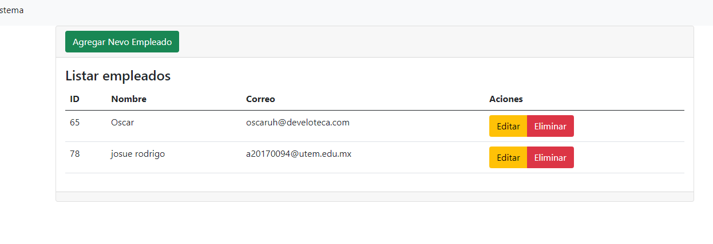

# Getting Started with Create React App

This project was bootstrapped with [Create React App](https://github.com/facebook/create-react-app).

## Available Scripts

In the project directory, you can run:

### `yarn start`

Runs the app in the development mode.\
Open [http://localhost:3000](http://localhost:3000) to view it in the browser.

The page will reload if you make edits.\
You will also see any lint errors in the console.

## CRUD

it will show all users in this view

in this view is to add the users

Pressing the delete button will show you a message if you want to delete it or not.

Pressing the edit button will send you to another view where you can edit the data.